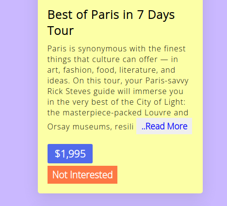
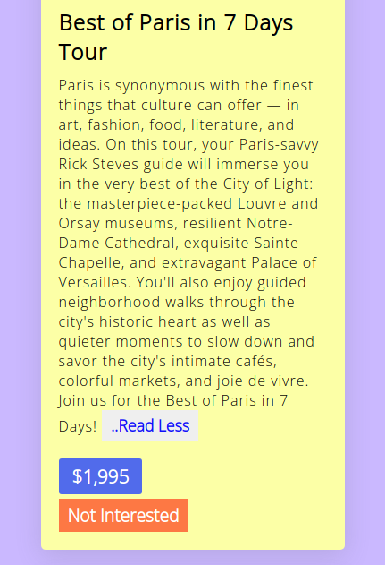

# Travel List React API






The default template project for [nano-react-app](https://github.com/nano-react-app/nano-react-app).

- `npm start` — This will spawn a development server with a default port of `3000`.
- `npm run build` — This will output a production build in the `dist` directory.

## Custom port

You can use the `-p` flag to specify a port for development. To do this, you can either run `npm start` with an additional flag:

```
npm start -- --port 1234
```

Or edit the `start` script directly:

```
vite --port 1234
```
# How it works
- Data is fetch using an API
- Map method used for mapping over data
- Default state is used for showing Loading... before Data gets fetched
- Conditional rendering and substring() method used for Readmore feature
- Filter array method used for remove a card from the list by comparing id and current id

# Features
- Remove a card by pressing Not interested
- Press Readmore button to expand the info
- Press Refesh Button to get the original data back